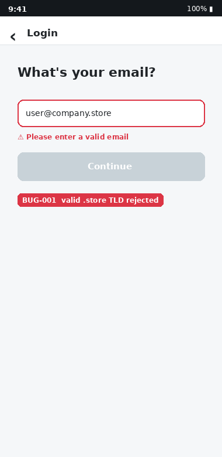
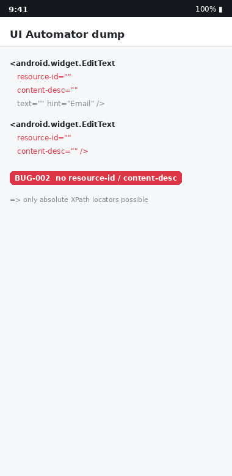
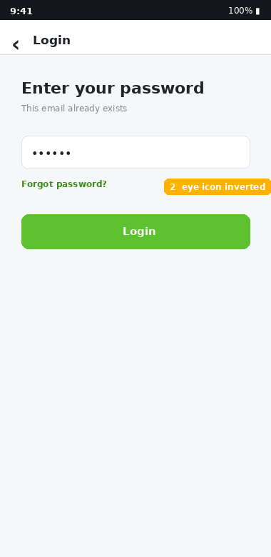
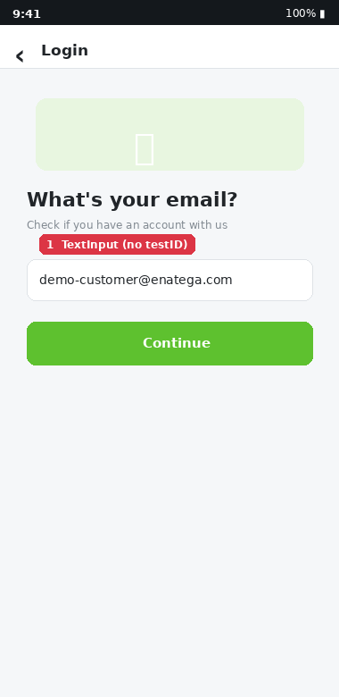
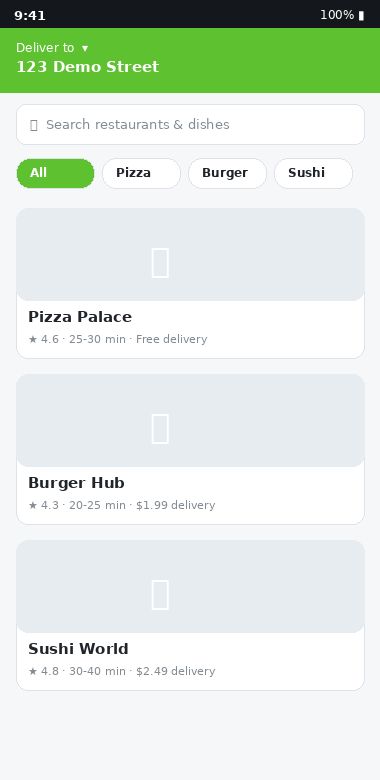

# 🐞 Bug Reports — Enatega Multivendor Customer App

**Tester:** Rozagul Nodirbekova  **Date:** 2026-08-10
**Flow under test:** Login → Browse Restaurant → Add to Cart → Checkout
**App under test:** Enatega Multivendor — Customer (React Native / Expo)

> Each report below uses the **exact Bug Report template from the assignment**
> (`ID · Title · Severity · Priority · Environment · Preconditions · Steps to Reproduce ·
> Expected Result · Actual Result · Attachments`). After every table there is a
> **📍 Where to see it in code** line pointing to the exact source path + line, so a
> developer can open the file and fix it directly.

**Severity:** 🔴 Critical · 🟠 Major · 🟡 Minor · ⚪ Trivial  |  **Priority:** 🔴 High · 🟠 Medium · ⚪ Low
**Common environment:** Pixel 6 (emulator) · Android 14 (API 34) · App `1.1.31` (JS bundle `5.0.0`) · Backend `aws-server-v2.enatega.com`
**Repo of the app under test:** `enatega/food-delivery-multivendor` → paths below are relative to `enatega-multivendor-app/`

---

## BUG-001 — Valid emails with modern TLDs are rejected at login

| Field | Content |
|---|---|
| **ID** | BUG-001 |
| **Title** | Login email validation rejects valid addresses whose TLD is longer than 3 characters (`.store`, `.online`, `.info`) |
| **Severity** | 🟠 Major |
| **Priority** | 🔴 High |
| **Environment** | Pixel 6 · Android 14 · App 1.1.31 |
| **Preconditions** | App installed; on the Login (email) screen; network available |
| **Steps to Reproduce** | 1. Launch app → tap **Login**.<br>2. In the email field type `user@company.store`.<br>3. Tap **Continue**. |
| **Expected Result** | The address is accepted as valid; the app proceeds to the password / registration step. |
| **Actual Result** | Inline error *“Please enter a valid email”* is shown and the flow is blocked. Any TLD of 4+ characters (`.store`, `.online`, `.email`, `.museum`) is rejected. |
| **Attachments** | `screenshots/bug-01-email-regex.png` |

📍 **Where to see it in code:** `enatega-multivendor-app/src/screens/Login/useLogin.js:80`
```js
const emailRegex = /^\w+([\\.-]?\w+)*@\w+([\\.-]?\w+)*(\.\w{2,3})+$/
// the final group (\.\w{2,3})+ caps the TLD at 2–3 chars; also [\\.-] wrongly escapes to backslash-or-dot
```



---

## BUG-002 — Interactive elements expose no accessibility id / test id

| Field | Content |
|---|---|
| **ID** | BUG-002 |
| **Title** | Login inputs, buttons and cart quantity controls have no `testID` / `accessibilityLabel`, so they carry empty `resource-id` and `content-desc` |
| **Severity** | 🟠 Major |
| **Priority** | 🔴 High |
| **Environment** | Pixel 6 · Android 14 · App 1.1.31 |
| **Preconditions** | `adb` / UI Automator available, or TalkBack screen reader enabled |
| **Steps to Reproduce** | 1. Open the Login screen.<br>2. Run `adb shell uiautomator dump` (or enable TalkBack).<br>3. Inspect the email / password `EditText` and the **Continue** button. |
| **Expected Result** | Each control has a stable `resource-id` (from `testID`) and a meaningful `content-desc` (from `accessibilityLabel`) for automation **and** screen readers. |
| **Actual Result** | `resource-id` and `content-desc` are empty. TalkBack announces the buttons as “button, unlabeled”. Automation is forced onto brittle absolute XPath. |
| **Attachments** | `screenshots/bug-02-no-testid.png` |

📍 **Where to see it in code:** `enatega-multivendor-app/src/screens/Login/Login.js:69` (email `TextInput`), `:88` (password `TextInput`), `:117` (submit `TouchableOpacity`) — none carry `testID` / `accessibilityLabel`.



---

## BUG-003 — Password “show/hide” eye icon is inverted

| Field | Content |
|---|---|
| **ID** | BUG-003 |
| **Title** | On the password step the eye icon shows the *opposite* state of the field, confusing the user |
| **Severity** | 🟡 Minor |
| **Priority** | 🟠 Medium |
| **Environment** | Pixel 6 · Android 14 · App 1.1.31 |
| **Preconditions** | Existing account; reached the password entry step |
| **Steps to Reproduce** | 1. Enter a registered email → **Continue**.<br>2. Observe the password field (text is masked) and the eye icon.<br>3. Tap the eye icon and observe. |
| **Expected Result** | While the password is **hidden**, the icon should invite “show” (an open eye); tapping reveals the text and switches to a crossed-out eye. |
| **Actual Result** | Initial state is masked but the icon already shows `eye-slash`; the affordance is reversed, so users tap expecting the wrong outcome. |
| **Attachments** | `screenshots/02-login-password.png` |

📍 **Where to see it in code:** `enatega-multivendor-app/src/screens/Login/useLogin.js:33` (`showPassword` initialised to `true`) + `src/screens/Login/Login.js:88-89` (`secureTextEntry={showPassword}` and icon `showPassword ? 'eye-slash' : 'eye'`).



---

## BUG-004 — Demo credentials hard-coded in the client bundle

| Field | Content |
|---|---|
| **ID** | BUG-004 |
| **Title** | The client auto-fills a real account’s password and ships demo credentials in source |
| **Severity** | 🟠 Major |
| **Priority** | 🟠 Medium |
| **Environment** | Pixel 6 · Android 14 · App 1.1.31 |
| **Preconditions** | None |
| **Steps to Reproduce** | 1. On the email step, enter `demo-customer@enatega.com` → **Continue**.<br>2. Observe that the password field is pre-populated and login succeeds without typing a password. |
| **Expected Result** | No credential is ever hard-coded or auto-filled in the shipping client; demo data lives only on a seeded backend. |
| **Actual Result** | The password `123123` is injected client-side for the demo account; a commented `defaultValue='demo-customer@enatega.com'` also remains in source. Anyone reading the bundle obtains working credentials. |
| **Attachments** | `screenshots/01-login-email.png` |

📍 **Where to see it in code:** `enatega-multivendor-app/src/screens/Login/useLogin.js:63-64` (`if (emailRef.current === 'demo-customer@enatega.com') setPassword('123123')`) + `src/screens/Login/Login.js:74` (commented demo default).



---

## BUG-005 — “Free Delivery” / “Accept Vouchers” offer filters return an empty list

| Field | Content |
|---|---|
| **ID** | BUG-005 |
| **Title** | Applying the **Offers → Free Delivery** or **Accept Vouchers** filter clears the entire restaurant list |
| **Severity** | 🟠 Major |
| **Priority** | 🟠 Medium |
| **Environment** | Pixel 6 · Android 14 · App 1.1.31 |
| **Preconditions** | Logged in; on the Menu / Discovery screen with restaurants listed |
| **Steps to Reproduce** | 1. Open the restaurant list.<br>2. Open **Offers / Filters**.<br>3. Select **Free Delivery** (or **Accept Vouchers**) → **Apply**. |
| **Expected Result** | The list is filtered to restaurants that offer free delivery / accept vouchers. |
| **Actual Result** | The list becomes **empty** for every location, because the backend returns `freeDelivery` / `acceptVouchers` as `false` / `null` for all restaurants (no admin UI ever sets them). |
| **Attachments** | `screenshots/03-home-restaurants.png` |

📍 **Where to see it in code:** filter reads `item?.freeDelivery` / `item?.acceptVouchers` in `enatega-multivendor-app/src/screens/Menu/Menu.js`; full root-cause analysis in `enatega-multivendor-app/QUAL-012_BACKEND_INSTRUCTIONS.md`.



---

## 📊 Summary

| ID | Title | Severity | Priority | Where to see it in code |
|---|---|---|---|---|
| BUG-001 | Valid modern-TLD emails rejected at login | 🟠 Major | 🔴 High | `src/screens/Login/useLogin.js:80` |
| BUG-002 | No testID / accessibilityLabel on controls | 🟠 Major | 🔴 High | `src/screens/Login/Login.js:69,88,117` |
| BUG-003 | Password eye icon inverted | 🟡 Minor | 🟠 Medium | `src/screens/Login/useLogin.js:33` · `Login.js:88-89` |
| BUG-004 | Demo credentials hard-coded in client | 🟠 Major | 🟠 Medium | `src/screens/Login/useLogin.js:63-64` · `Login.js:74` |
| BUG-005 | Offer filters return empty restaurant list | 🟠 Major | 🟠 Medium | `src/screens/Menu/Menu.js` · `QUAL-012_BACKEND_INSTRUCTIONS.md` |

> 📄 A fully colour-coded version of these tables is in **`docs/pdf/bug-reports.pdf`**.
