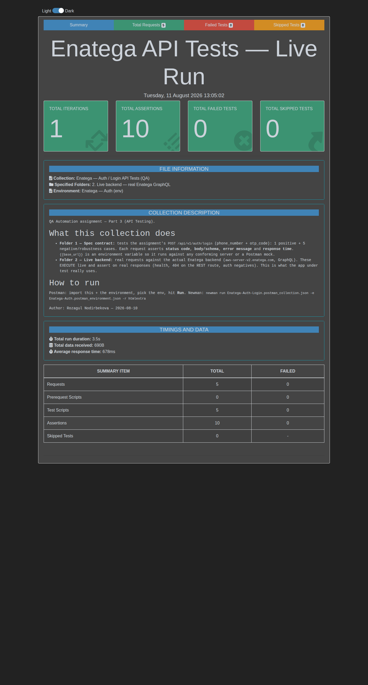

# 🔌 Part 3 — API Testing (Postman)

**Author:** Rozagul Nodirbekova · **Date:** 2026-08-10

## Files

| File | Purpose |
|---|---|
| `Enatega-Auth-Login.postman_collection.json` | The collection — import into Postman or run with Newman |
| `Enatega-Auth.postman_environment.json` | Environment: `base_url`, `graphql_host`, `auth_token` |
| `results/newman-live-report.html` | **Rich HTML run report** (open in a browser) |
| `results/newman-live-bonus.json` | Machine-readable Newman report |
| `screenshots/postman-live-run.png` | Screenshot of the passing live run |
| `../docs/pdf/api-postman-run-report.pdf` | PDF of the run report |

## Endpoint under test (per assignment)

```http
POST {{base_url}}/api/v1/auth/login
Content-Type: application/json

{ "phone_number": "+998901234567", "otp_code": "123456" }
```

`{{base_url}}` is an **environment variable** so the collection runs against any conforming
server, a Postman **mock server**, or a local backend — nothing is hard-coded.

## What API testing means here (what to actually check)

For each request a good API test asserts **more than status code**:
- **HTTP status** (200 / 400 / 401 / 404 / 422)
- **Body & schema** (token present & is a string; error object shape)
- **Error message** (regex, case-insensitive → resilient to wording changes)
- **Response time** (SLA, e.g. < 2 s)
- **Side effects** (positive test chains the token into `{{auth_token}}` for reuse)

## Test matrix

### Folder 1 — Spec contract `POST /api/v1/auth/login`
| # | Case | Body | Expected | Key assertions |
|---|---|---|---|---|
| 1 | ✅ Positive | valid phone + valid OTP | `200` | JSON, non-empty `token` (saved), schema, < 2 s |
| 2 | ⛔ Invalid OTP | otp `000000` | `401` | no token, error `/otp\|invalid/` |
| 3 | ⛔ Missing phone | `{otp_code}` only | `400` | error names `phone`, no token |
| 4 | ⛔ Bad phone format | phone `12345` | `400/422` | error `/format\|valid/` |
| 5 | ⛔ Empty body | `{}` | `400` | no token |
| 6 | ⛔ Wrong Content-Type | `text/plain` | `415/400` | no 5xx (server doesn’t crash) |

### Folder 2 — Live backend (real Enatega GraphQL, executed)
| # | Case | Result (captured live) | Assertions |
|---|---|---|---|
| 7 | ✅ Health `{ __typename }` | `200` `{"data":{"__typename":"Query"}}` | status, `__typename==Query`, < 3 s |
| 8 | REST route on real backend | `404` | route absent (Finding **B3**) |
| 9 | GraphQL login, bad var type | `400` `GRAPHQL_VALIDATION_FAILED` | validation code (Finding **B2**) |
| 10 | GraphQL login, wrong password | `200`, `data:null` + `errors[]` | no token |
| 11 | Protected query, no token | `200`, `Unauthorized: token missing` | error message |

> **Live result: 5 requests · 10 assertions · 0 failures.** See the screenshot below.

## Live run screenshot



## Real request/response examples (captured live)

**Positive health check**
```http
POST https://aws-server-v2.enatega.com/graphql
{ "query": "{ __typename }" }
→ 200 OK
{ "data": { "__typename": "Query" } }
```

**Negative — protected query without a token**
```http
POST https://aws-server-v2.enatega.com/graphql
{ "query": "{ configuration { currency currencySymbol } }" }
→ 200 OK
{ "errors": [ { "message": "Unauthorized: token missing",
  "extensions": { "code": "INTERNAL_SERVER_ERROR" } } ], "data": null }
```

**Negative — invalid GraphQL variable type**
```http
→ 400 Bad Request
{ "errors": [ { "message": "Variable \"$type\" of type \"String\" used in position expecting type \"String!\".",
  "extensions": { "code": "GRAPHQL_VALIDATION_FAILED" } } ] }
```

## How to run

**Postman (UI):** import both JSON files → select the *Enatega — Auth (env)* environment →
open the collection → **Run**. Screenshot the green **Test Results** tab per request.

**Newman (CLI) with the rich report:**
```bash
npm install -g newman newman-reporter-htmlextra
newman run Enatega-Auth-Login.postman_collection.json \
  -e Enatega-Auth.postman_environment.json \
  -r cli,htmlextra --reporter-htmlextra-export results/newman-live-report.html
# run only the live folder that hits the real backend:
newman run ... --folder "2. Live backend — real Enatega GraphQL"
```

## What to show the reviewer (screenshots checklist)
1. Collection Runner / htmlextra **summary** — total requests & assertions, 0 failed ✅ (above).
2. The **positive** request: body + `200` + token, with the **Test Results** all green.
3. One **negative** request: the `4xx` status **and** the asserted error message.
4. The **environment** panel showing `base_url` (proves no hard-coded host).
