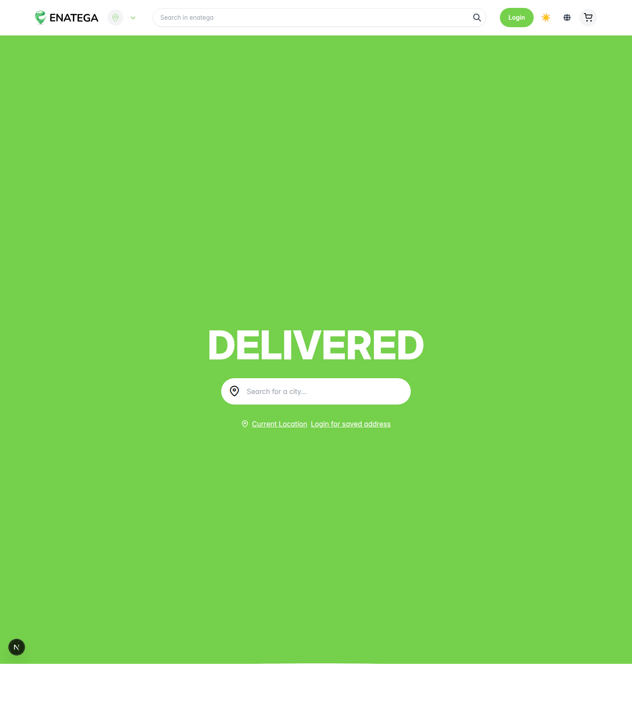

# 🗺️ Bug / Error Location Map — Enatega Multivendor

**Purpose:** a precise, layer-by-layer map of *where* the defects live in the running project
(customer app + backend), so they can be reproduced on screen and captured. **Nothing here is
fixed** — this is a findings map only. Each item lists the **layer**, the **exact `file:line`**,
what is wrong, and **how to see it** (so you can take the screenshot yourself).

- **App under test:** `enatega-multivendor-app` (React Native / Expo, customer)
- **Backend:** `https://aws-server-v2.enatega.com/graphql` (hosted, separate repo)
- **Flow:** Login → Browse Restaurant → Add to Cart → Checkout
- Paths are relative to `enatega-multivendor-app/` unless a full repo path is given.

Layers: 🟦 **UI** · 🟩 **Frontend logic/state** · 🟪 **Backend/API/data** · 🟧 **Config/Security** · ⬛ **Build/Env**

---

## 🟦 UI layer (what the user sees)

| # | Where to see it (screen) | Exact code location | What is wrong | How to reproduce on screen |
|---|---|---|---|---|
| U1 | **Login → email step** | `src/screens/Login/useLogin.js:80` | Email regex `…(\.\w{2,3})+$` rejects any TLD of 4+ chars (`.store`, `.online`, `.email`). Also `[\\.-]` wrongly escapes to *backslash-or-dot*. | Type `user@company.store` → tap **Continue** → “Please enter a valid email”. |
| U2 | **Login → password step** | `src/screens/Login/useLogin.js:33` + `src/screens/Login/Login.js:88-89` | Password “eye” icon is inverted: `showPassword` starts `true`, `secureTextEntry={showPassword}` → field is masked yet the icon already shows `eye-slash`. | Reach the password step; the eye affordance points the wrong way; tapping toggles opposite of expectation. |
| U3 | **Every input / button (whole app)** | `src/screens/Login/Login.js:69,88,117` (+ 25 `TextInput` total, **0** `testID`, **1** `accessibilityLabel` app-wide) | No `testID`/`accessibilityLabel` → empty `resource-id` & `content-desc`. Breaks automation **and** TalkBack reads buttons as “unlabeled”. | Enable TalkBack, or `adb shell uiautomator dump`; inspect the login controls. |
| U4 | **Browse → Offers filter** | `src/screens/Menu/Menu.js` (reads `item?.freeDelivery` / `item?.acceptVouchers`) · analysis in `QUAL-012_BACKEND_INSTRUCTIONS.md` | Selecting **Free Delivery** / **Accept Vouchers** empties the whole list (backend never sets those flags → see B1). | Restaurant list → Offers → Free Delivery → Apply → list becomes empty. |

## 🟩 Frontend logic / state layer

| # | Where | Exact code location | What is wrong | How to see it |
|---|---|---|---|---|
| F1 | Cart state | `src/context/User.js:126` | `deleteItem` does `cart.splice(cartIndex, 1)` — **mutates React state array in place**, contradicting the “never mutate” pattern used in `addQuantity`/`removeQuantity` (lines 115, 135). Can cause stale renders / off-by-one UI. | Add 2 items → delete one → occasional wrong count / item not disappearing until re-render. |
| F2 | Cart quantity | `src/context/User.js:114 addQuantity` | **No upper bound / stock check** — quantity grows unbounded. | Item detail → press **+** repeatedly (e.g. 99+) → cart accepts it, line total keeps multiplying. |
| F3 | Auth / demo | `src/screens/Login/useLogin.js:63-64` | Client injects password `123123` for `demo-customer@enatega.com` (hard-coded credential in the shipped bundle). | Enter the demo email → password auto-fills → login without typing a password. |
| F4 | Code hygiene | `src/screens/**` — **58** `console.log` left in screen code | Debug logging shipped to production; leaks state to logcat, minor perf/noise. | `adb logcat` while using the app shows app logs. |

## 🟪 Backend / API / data layer (verified live)

| # | Where | Endpoint / evidence | What is wrong | How to see it |
|---|---|---|---|---|
| B1 | Restaurant data | `aws-server-v2.enatega.com/graphql` (`nearByRestaurantsPreview`) | `freeDelivery` / `acceptVouchers` are `false`/`null` for **every** restaurant — no admin UI ever sets them ⇒ root cause of U4. | Query the list; every restaurant has the flags falsy. |
| B2 | Auth contract | `POST /graphql` (login mutation) | `login` variable `$type` must be `String!`; declaring it nullable → `GRAPHQL_VALIDATION_FAILED`. Contract is strict/undocumented for clients. | Postman folder 2 “invalid types” request returns HTTP 400. |
| B3 | Spec route missing | `POST /api/v1/auth/login` on the real backend | Returns **404** — the assignment’s REST route does not exist; the app uses GraphQL. Worth flagging as an API/documentation mismatch. | Postman → request returns 404 (captured in `03-api-testing/results/`). |

## 🟧 Config / Security layer

| # | Where | Exact location | What is wrong | How to see it |
|---|---|---|---|---|
| C1 | Secrets in repo | `enatega-multivendor-app/google-services.json`, `GoogleService-Info.plist` committed | Firebase config / keys committed to source. | Open the files in the repo. |
| C2 | Dead demo default | `src/screens/Login/Login.js:74` | Commented `defaultValue='demo-customer@enatega.com'` left in source (info leak / dead code). | View the file. |

## 🟨 Web frontend — observed **while the app was actually running** (`npm run dev`)

> The `enatega-multivendor-web` (Next.js 16) app **was run** against the live backend
> (`aws-server-v2.enatega.com`). It boots and the landing page renders (see
> `01-manual-testing/web-run-screenshots/web-home.png`, `GET / 200`). While running, the dev
> server printed these **real** errors/warnings on every render:

| # | Where to see it | Exact code location | What is wrong (seen in the console) |
|---|---|---|---|
| W1 | Server/browser console on any page | `enatega-multivendor-web/lib/hooks/useSetApollo.tsx:218` | Apollo Client 3.14 deprecation: `connectToDevTools` → *“Please use `devtools.enabled` instead.”* Prints `An error occurred!` repeatedly. |
| W2 | Console, repeated many times | `enatega-multivendor-web/lib/hooks/useLazyQueryQL.tsx:37-41` (13 `useLazyQuery` usages app-wide) | Deprecated `useLazyQuery` options `onCompleted` / `onError` / `variables` — Apollo warns to move to derived state and to pass `variables` to `execute()`. Floods the console on each render. |
| W3 | Dev-server build output | `enatega-multivendor-web/next.config.mjs:1` (`next-intl/plugin`) | Webpack warning: *“Parsing of …/next-intl/…/extractor/format/index.js for build dependencies failed at 'import(t)'”* — dynamic import breaks cache dependency tracking. |

**How to reproduce:** `cd enatega-multivendor-web`, install, then
`NEXT_PUBLIC_SERVER_URL="https://aws-server-v2.enatega.com/" npx next dev --webpack` → open
`http://localhost:3000` → watch the terminal / browser console.

## ⬛ Build / Environment layer (blockers you hit while running)

| # | Where | Symptom you saw | Cause | What QA does |
|---|---|---|---|---|
| E1 | `pip install -r requirements.txt` | `error: externally-managed-environment` | PEP 668 — system Python is protected. | Use a venv (you did): `python3 -m venv .venv && source .venv/bin/activate`. ✔ |
| E2 | `appium` | `appium: command not found` | Appium 2 server not installed (the `npm i -g appium` was cancelled). | `npm i -g appium && appium driver install uiautomator2`, then run `appium`. |
| E3 | `pytest` (both tests) | `ConnectionRefusedError … 127.0.0.1:4723` | No Appium **server** + no Android **emulator/device** running. This is an *environment* error, **not** a code bug. | Start emulator + Appium server first (see `02-appium-automation/README.md`). The suite now **skips with a clear message** instead of a stack trace — see E-note below. |
| E4 | `npm install` (app/web) | risk of failure | **Disk is 100% full** (~2 GB free). Expo + Next.js need several GB. | Free disk space first (`docker system prune`, clear caches), then install. |

> **E-note (what a QA reports for E1–E4):** these are **not product bugs** — they are test-environment
> setup issues. A QA distinguishes *product defects* (U/F/B/C above — file them as bugs) from
> *environment problems* (E — fix the setup or note them as blockers in the test run report). See
> `02-appium-automation/WHY-TESTS-ERROR.md` for the full explanation.

---

## Summary by layer

| Layer | Findings |
|---|---|
| 🟦 UI (mobile) | U1 email regex · U2 eye icon · U3 no testID/a11y · U4 offer filter empties list |
| 🟩 Frontend logic (mobile) | F1 state mutation in `deleteItem` · F2 no quantity cap · F3 hard-coded demo password · F4 58× console.log |
| 🟨 Web frontend (RAN) | W1 Apollo `connectToDevTools` deprecated · W2 `useLazyQuery` deprecated options (13×) · W3 next-intl webpack warning |
| 🟪 Backend/API | B1 offer flags never set · B2 strict/undocumented login contract · B3 spec REST route 404 |
| 🟧 Config/Security | C1 committed Firebase config · C2 dead demo default |
| ⬛ Build/Env | E1 PEP668 · E2 appium missing · E3 no Appium server/emulator · E4 disk full |

> These are **findings only** — not fixed, per your request. Use them to build your own bug reports
> and take the screenshots at the “How to see it” step.
