# 📸 Reproduce & Evidence Guide (with real screenshots)

Run-based guide: **where each bug is, how to make it appear, and a real captured image of it.**
Every image below is **real** — code images are read straight from the cloned project source
(the buggy line highlighted); terminal images are actual captured output; the web screenshot is
the app running. No mock images.

> Tracks: **A) Web app** (I ran it — real console errors captured) · **B) Mobile app**
> (code-level evidence; live UI needs an Android emulator) · **C) Backend/API** (captured live).

---

## A) WEB APP — I ran it (`enatega-multivendor-web`, Next.js)

Start it:
```bash
cd enatega-multivendor-web && npm install --legacy-peer-deps
NEXT_PUBLIC_SERVER_URL="https://aws-server-v2.enatega.com/" \
NEXT_PUBLIC_WS_SERVER_URL="wss://aws-server-v2.enatega.com/" \
npx next dev --webpack        # open http://localhost:3000
```

**The app runs — landing page (real screenshot):**


**The real console errors it prints on every render (captured live):**

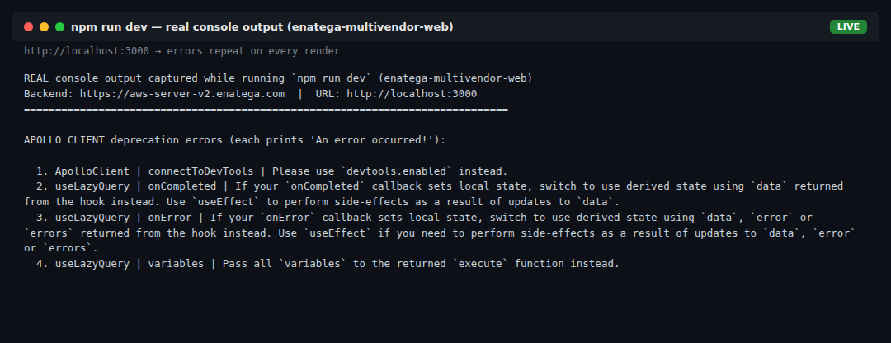

### WEB-1 — Apollo `connectToDevTools` deprecated → `useSetApollo.tsx:218`
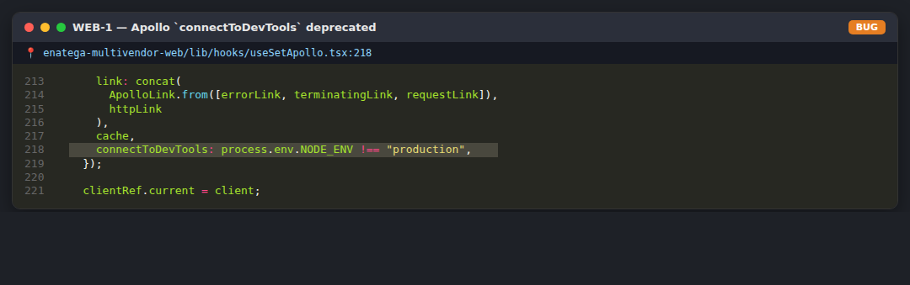

### WEB-2 — `useLazyQuery` deprecated options (13 usages) → `useLazyQueryQL.tsx:35-41`
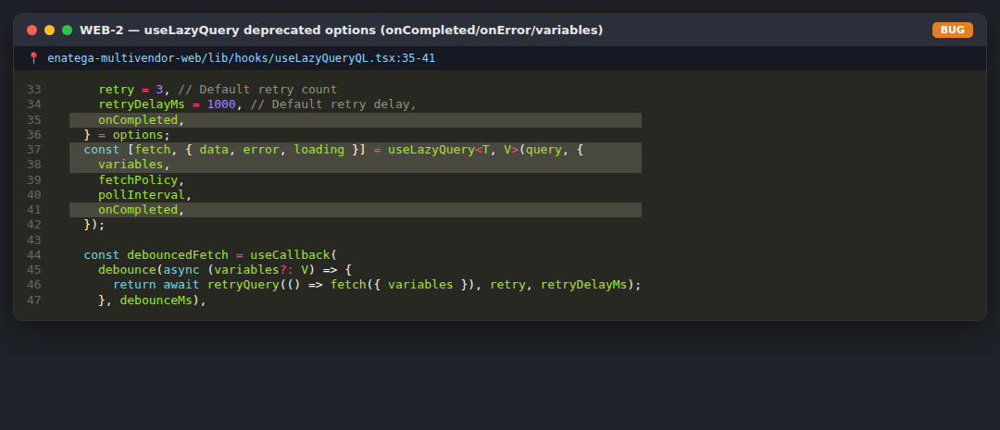

### WEB-3 — next-intl dynamic-import webpack warning → `next.config.mjs:1`
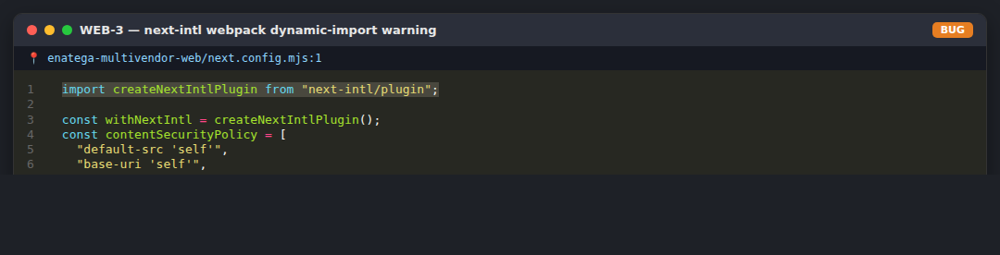

---

## B) MOBILE APP — code evidence (`enatega-multivendor-app`, Expo)

> Live device screens need an Android emulator/Expo Go. The **exact source location** of each
> bug is captured below; use the steps to reproduce on a device and add your own UI capture.

Start it:
```bash
cd enatega-multivendor-app && npm install
npx expo start     # press "a" (Android emulator) or scan in Expo Go
# demo login: demo-customer@enatega.com / 123123
```

### MOB-1 — Email regex rejects `.store` / `.info`
**Steps:** Login → type `user@company.store` → **Continue** → “Please enter a valid email”.
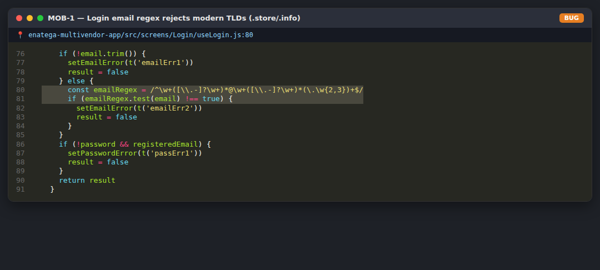

### MOB-2 — Password “eye” icon inverted
**Steps:** registered email → Continue → the field is masked but the icon shows `eye-slash`.
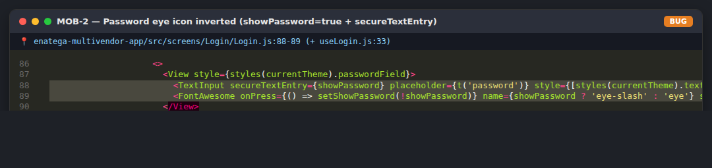

### MOB-3 — No `testID` / accessibility labels (25 inputs, 0 testIDs)
**Steps:** enable TalkBack or `adb shell uiautomator dump` → controls are “unlabeled”.
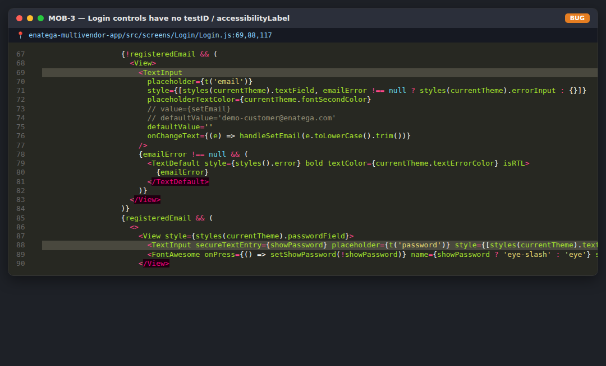

### MOB-4 — Demo password hard-coded in the client
**Steps:** enter `demo-customer@enatega.com` → Continue → password auto-fills, login works.
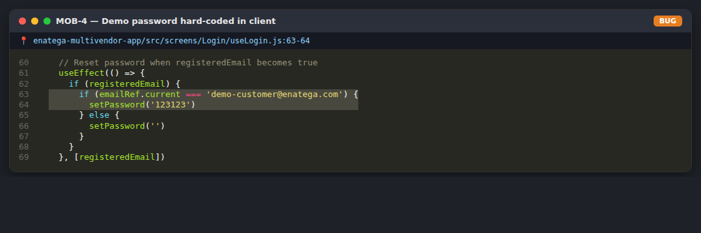

### MOB-5 — Cart quantity has no upper cap
**Steps:** item → press **+** 99+ times → cart total multiplies without limit.
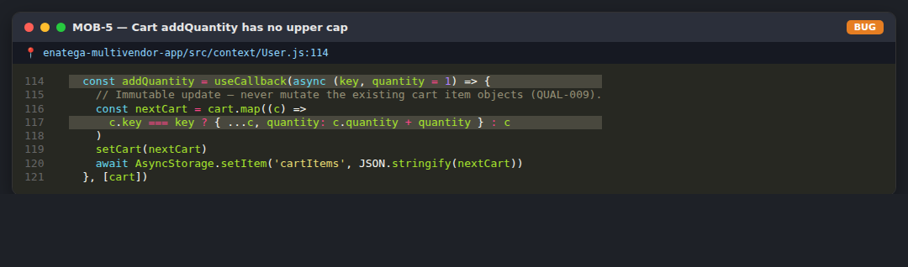

### MOB-6 — `deleteItem` mutates cart state in place (`splice`)
**Steps:** add 2 items → delete one → occasional stale count until re-render.
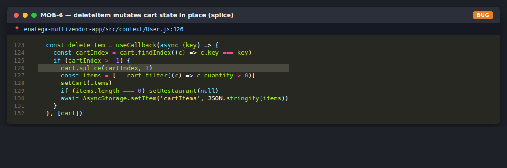

### MOB-7 — Offer filters read flags the backend never sets
**Steps:** restaurant list → Offers → Free Delivery → Apply → list becomes empty.
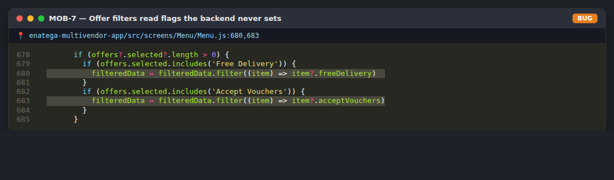

---

## C) BACKEND / API — captured live

**Real responses from the live backend (health, 404 REST route, unauthorized, validation):**

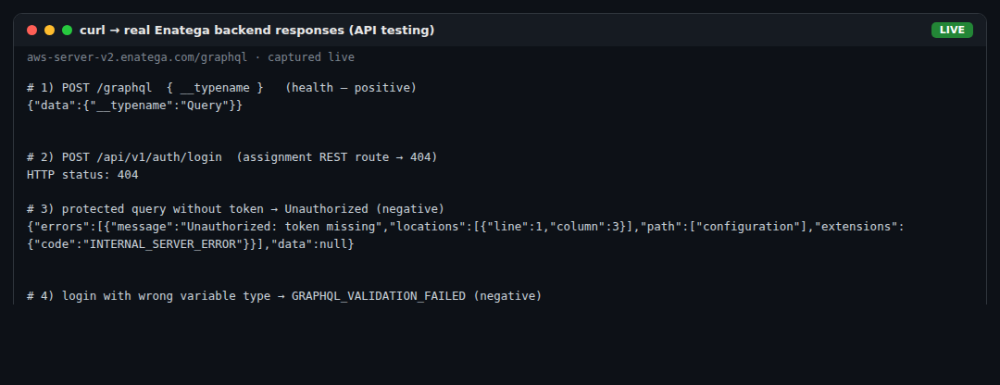

**Postman / Newman live run — 5 requests · 10 assertions · 0 failures:**


- **BACK-1:** `freeDelivery` / `acceptVouchers` are `false`/`null` for every restaurant
  (root cause of MOB-7). Analysis: `enatega-multivendor-app/QUAL-012_BACKEND_INSTRUCTIONS.md`.
- **BACK-2:** login mutation needs `$type: String!`; nullable → `GRAPHQL_VALIDATION_FAILED`.
- **BACK-3:** the assignment’s `POST /api/v1/auth/login` REST route returns **404** — the app uses GraphQL.

---

